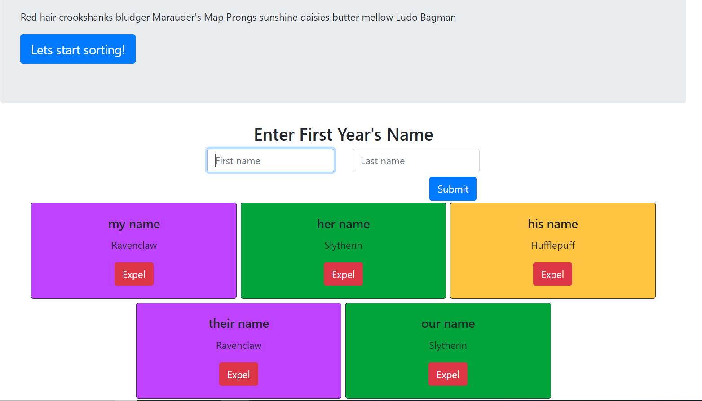

# Sorting Hat

## Purpose

I intended to create a system that randomly assigns pseudo students to the fictional houses of the Harry Potter Universe, as created by J. K. Rowling. This was achieved by using Math operations and a simple array to assign house names to input students.

I also wanted to implement Bootstrap styling to ensure cross browser uniform styling. This can be seen by viewing the webpage

## Snapshot

## To View

1. Clone repository to local machine.
1. Using http-server (`$ npm install http-server`) feed project to the port 8888 (`-p 8888`)
1. open localhost:8888 in your browsers address bar

## Notes

You can see that conditional styling was applied to each class.